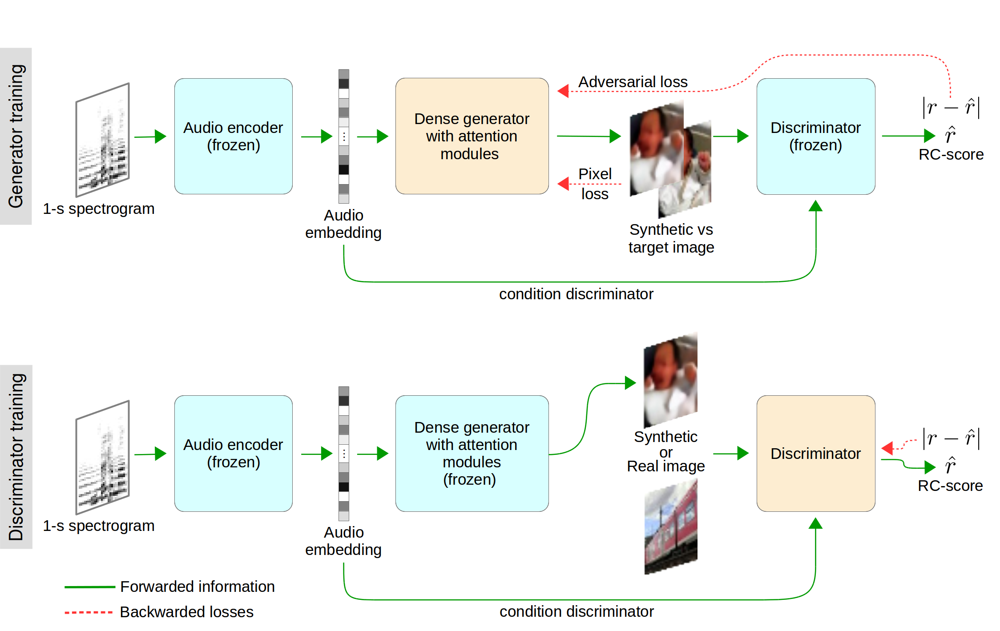

# S2I Translation

Implementation of a sound-to-image (S2I) translation system using PyTorch



Sound-to-Imagination: Unsupervised Crossmodal Translation Using Deep Dense Network Architecture
 [Leonardo A. Fanzeres](https://futur.upc.edu/LeonardoAreiasFanzeres), [Climent Nadeu](https://futur.upc.edu/ClimentNadeuCamprubi)
 International Journal of Computer Vision (UNDER REVIEW), 2021 | [Arxiv](https://arxiv.org/abs/2106.01266)

The motivation of our research is to develop a sound-to-image (S2I) translation system for enabling a human receiver to visually infer the occurrence of sound related events. We expect the computer to ‘imagine’ the scene from the captured sound, generating original images that picture the sound emitting source.

## Setup

### Requirements (tested versions)

```
cuda (9.0.176) + CuDNN
matplotlib (2.2.2 to 3.1.1)
numpy (1.14.2 to 1.17.2)
python (3.5.2 to 3.7.4)
scipy (1.0.1 to 1.3.1)
torch (1.1.0)
torchvision (0.3.0)
```

### Get Started
1. Install Pytorch
2. Install required packages listed above
3. Clone or download this repository
4. Download the datasets (to be available)
5. Train the model executing (to be uploaded)
6. Execute a qualitative test generating the translated images (to be uploaded)

## Acknowledgments
The present work was supported in part by the Brazilian National Council for Scientific and Technological Development (CNPq) under the PhD grant 200884/2015-8. Also, the work was partly supported by the Spanish State Research Agency (AEI) project PID2019-107579RB-I00/AEI/10.13039/501100011033. Furthermore, the authors are thankful to Santiago Pascual for his advice on the implementation of GANs. We also thank Josep Pujal for his support in using the computational resources of the Signal Theory and Communications Department at the Polytechnic University of Catalonia (UPC).
